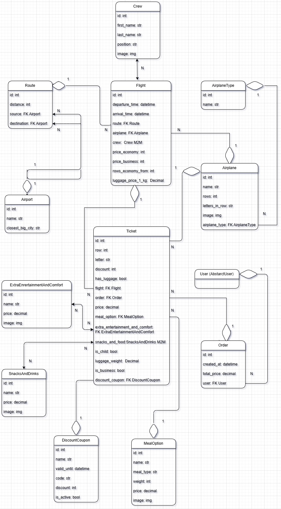

# Airport API

A REST API for managing flights, bookings, and orders. Built with Django, Django REST Framework, Docker, and JWT authentication. Fully covered by tests and documented with Swagger (via **drf-spectacular**).


---

## Features

- Custom user model with email/password login (no username)  
- Powerful filtering on almost all endpoints by multiple fields  
- Admin Panel
- Roles and permissions:  
  - Admins have full access  
  - Regular users have read-only access except for orders, where they can create and view their own orders and tickets  
- Photos for snacks, extra add-ons, meal options, and staff (with positions)  
- Each flight is linked to a crew, route, business/economy prices, baggage price per kg, and the economy class starting row 
- Flight list shows available business and economy seats counts. (Partial response shown below):


- Flight detail provides a full list of free seats, prices, crew info with photos, aircraft info, schedule, and airports. (Partial response shown below):


---

## Booking logic

- Automatic ticket price calculation based on:  
  - Discounts (coupons, child passenger)  
  - Baggage (quantity × price per kg on the flight)  
  - Options selected (meal options, extra entertainment and comfort like tablets, pillows, snacks, and drinks)  
- Each ticket stores its final price  
- Order stores the total price of all tickets

---

## Performance Optimization

- All pages optimized using **Django Debug Toolbar** for efficient debugging and performance monitoring.

---

## Tests and Coverage

- Total tests: 88  
- Tests written using Django's built-in `TestCase`  
- Code coverage:  
  - views.py — 98%  
  - serializers.py — 86%  
  - models.py — 99%  
  - validators.py — 86%  
  - admin.py — 83%

---

## How to run

1. Clone the repo  
2. Create and fill in `.env`
→ Use the provided `.env.example` as a template.
3. Run Docker Compose:  
   ```bash  
   docker-compose up --build  
- Open Swagger docs at http://localhost:8000/api/schema/swagger-ui/

- Authorization:  http://localhost/api/user/token -> Email: `john.doe@example.com`. Password: `1qazcde3`

- Start using the API!

## Tech stack
- Django, Django REST Framework

- Django ORM

- Docker

- JWT Authentication

- Swagger via drf-spectacular

- Django Debug Toolbar

- Test using Django's build-in `TestCase` with coverage


## api/doc/swagger


